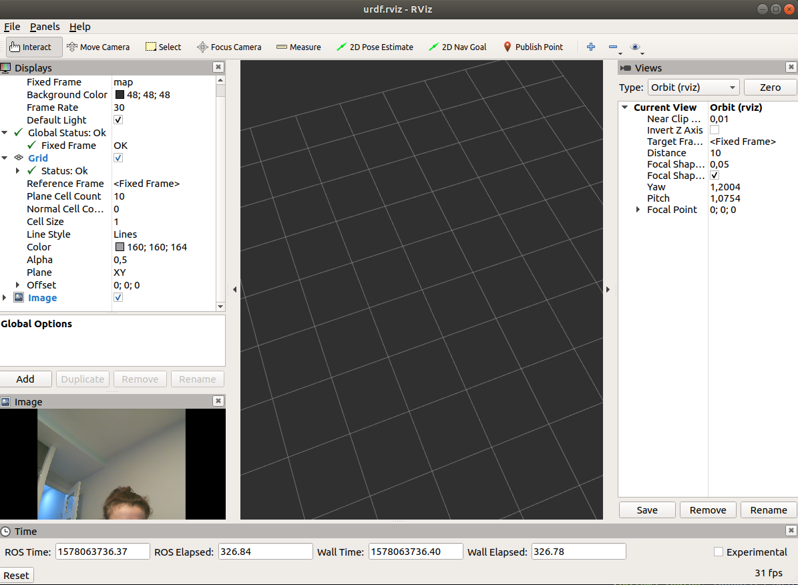

# RI_S2_JMA

Submit github URL
Submit answer for last item in a README or anyother file in the URL (just to practice git commands).

1. Create your <PROJECT> package and customize the package.xml.  
2. Create a file with parameter year equals to 2019
3. Create a launch file that loads that parameter in the namespace /masteruvic (if you run rosparam list, you should get /masteruvic/year, if you run rosparam get /masteruvic/year you should get 2019)
4. Add an rviz node to the launch file
5. Include the file usb_cam-test.launch from the package usb_cam

So, in the folder we have the following items:

 - **package.xml**: is the XML file that must be included with any catkin-compliant package's root folder.This file defines properties about the package such as the package name, version numbers, authors, maintainers, and dependencies on other catkin packages. It contains the email of the mantainer and the author.
 - **params.yaml**: is where the parameter *year* is defined as 2019.
 - **launch/launch_file.launch**: is the launch that loads the parameter in the *namespace /masteruvic*, adds a rviz node to the launch file and includes the file usb_cam-test.launch from the package usb_cam.
- **urdf/urdf.rviz**: is the file that contains the rviz initial configuration.

If we run the launch file:

**roslaunch RI_S2_JMA launch_file.launch**

We obtain the following the following:

What are the arguments of usb_cam-test.launch?
The arguments of usb_cam.test.launch are the following ones:

*- /usbcam/image_view/autosize
- /usbcam/image_view/colormap
- /usbcam/image_view/do_dynamic_scaling
- /usbcam/image_view/max_image_value
- /usbcam/image_view/min_image_value
- /usbcam/usb_cam/camera_frame_id
- /usbcam/usb_cam/image_height
- /usbcam/usb_cam/image_raw/compressed/format
- /usbcam/usb_cam/image_raw/compressed/jpeg_quality
- /usbcam/usb_cam/image_raw/compressed/png_level
- /usbcam/usb_cam/image_raw/compressedDepth/depth_max
- /usbcam/usb_cam/image_raw/compressedDepth/depth_quantization
- /usbcam/usb_cam/image_raw/compressedDepth/png_level
- /usbcam/usb_cam/image_raw/theora/keyframe_frequency
- /usbcam/usb_cam/image_raw/theora/optimize_for
- /usbcam/usb_cam/image_raw/theora/quality
- /usbcam/usb_cam/image_raw/theora/target_bitrate
- /usbcam/usb_cam/image_width
- /usbcam/usb_cam/io_method
- /usbcam/usb_cam/pixel_format
- /usbcam/usb_cam/video_device*
